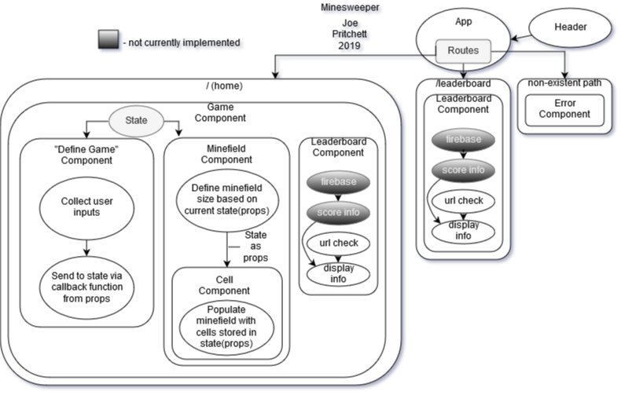

# Minesweeper in React
#### By Joe Pritchett

## Description

This project is a recreation of the game 'Minesweeper' using the React JavaScript library. The game allows the user to define the height and width of the minefield, as well as how many mines populate it.

In the future this project will be deployed, and allow users to push their high-scores to a database along with their initials - arcade style.

## Current Component Structure

## Notes

You might have noticed that the leaderboard component is rendered twice, this is intentional. On the home page the leaderboard *will* show the names and scores of the top 5 highest scores in the database. going to the leaderboard page will allow you to see the full list of all highscores.

##### Unforeseen issues:
~~It seems like trying to change the class of an element in React might require the use of state.~~
I thought that state would need to exist in my 'DefineGame' component, but realized that state could exist just within the 'Game' component if I ~~passed along the specs of the minefield as props~~ returned the specs.

~~Getting the current route seems more complex than I anticipated.~~
Looked at the react-router-dom documentation and discovered `location.hash`

##### Development Differences:

  The Angular version of this project relied on a lot of Angular-specific code such as ngFor, ngClass, and adding click listeners and  functions directly into the html.
  
  However the React version of this project contains all of the relevant information in one location, rather than being split among different components. The Redux version will take this concept even further.
